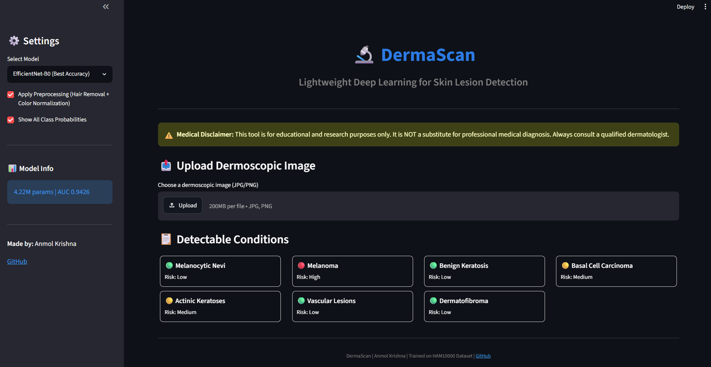
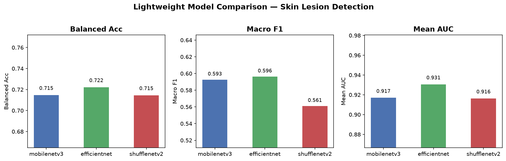
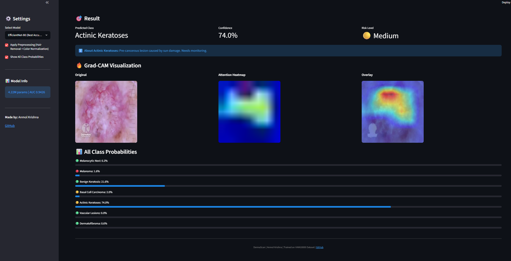
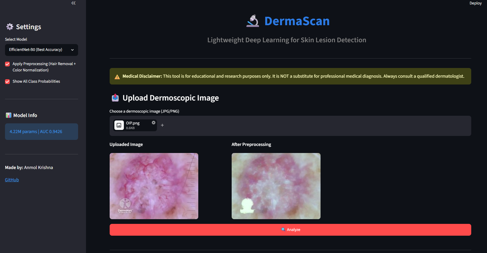

# 🔬 DermaScan — Skin Lesion Detection using Lightweight Deep Learning

[](https://dermascan-skin-detection.streamlit.app)
[](https://github.com/Krishn4nmol/DermaScan)
[](https://python.org)
[](https://pytorch.org)
[](LICENSE)

> A lightweight deep learning framework for automated skin lesion classification from dermoscopic images. Compares MobileNetV3, EfficientNet-B0, and ShuffleNetV2 with CBAM attention on the HAM10000 dataset.

---

## 🌐 Live Demo

**Try it now:** [dermascan-skin-detection.streamlit.app](https://dermascan-skin-detection.streamlit.app)



---

## 📊 Results

### Model Comparison

| Model | Params | Inference | Balanced Acc | Macro F1 | Mean AUC |
|-------|--------|-----------|-------------|----------|----------|
| MobileNetV3-Large | 3.09M | 12.9ms | 0.6931 | 0.5767 | 0.9322 |
| **EfficientNet-B0** | **4.22M** | 19.3ms | 0.7157 | 0.5992 | **0.9426** 🏆 |
| ShuffleNetV2 | **1.39M** | **12.0ms** | **0.7330** | **0.6210** | 0.9352 |



### Per-class AUC (EfficientNet-B0)

| Class | AUC |
|-------|-----|
| Vascular Lesions | 1.0000 🔥 |
| Dermatofibroma | 0.9934 |
| Basal Cell Carcinoma | 0.9758 |
| Melanocytic Nevi | 0.9551 |
| Actinic Keratoses | 0.9413 |
| Benign Keratosis | 0.8974 |
| Melanoma | 0.8354 |

---

## 🔥 Grad-CAM Visualizations



The model correctly focuses on the lesion region across all 7 classes, proving CBAM attention is learning meaningful medical features.

---

## 🏗️ Architecture

```
Dermoscopic Image
       ↓
Preprocessing (Hair Removal + Color Normalization)
       ↓
Lightweight CNN Backbone
(MobileNetV3 / EfficientNet-B0 / ShuffleNetV2)
       ↓
CBAM Attention Module
(Channel Attention + Spatial Attention)
       ↓
Global Average Pooling
       ↓
Dropout (p=0.4)
       ↓
Fully Connected + Softmax
       ↓
Predicted Lesion Class (7 classes)
```

---

## 📁 Project Structure

```
DermaScan/
├── checkpoints/          ← Trained model weights
├── configs/
│   └── config.yaml       ← All hyperparameters
├── dermascan_utils/
│   ├── dataset.py        ← HAM10000 dataset + augmentation
│   ├── losses.py         ← Focal loss
│   ├── metrics.py        ← Balanced acc, F1, AUC
│   └── preprocess.py     ← Hair removal + color normalization
├── models/
│   ├── backbones.py      ← MobileNetV3, EfficientNet, ShuffleNetV2
│   └── cbam.py           ← CBAM attention module
├── results/              ← Confusion matrices, training curves, plots
├── screenshots/          ← App screenshots
├── app.py                ← Streamlit web app (deployed)
├── app_local.py          ← Local app with full preprocessing
├── train.py              ← Training script
├── evaluate.py           ← Evaluation + Grad-CAM
├── compare_models.py     ← 3-model comparison
└── prepare_data.py       ← Dataset preparation
```

---

## 🗂️ Dataset

**HAM10000** — Human Against Machine with 10,000 training images

| Class | Label | Images |
|-------|-------|--------|
| Melanocytic Nevi | nv | 6,705 |
| Melanoma | mel | 1,113 |
| Benign Keratosis | bkl | 1,099 |
| Basal Cell Carcinoma | bcc | 514 |
| Actinic Keratoses | akiec | 327 |
| Vascular Lesions | vasc | 142 |
| Dermatofibroma | df | 115 |

Download: [Kaggle — HAM10000](https://www.kaggle.com/datasets/kmader/skin-cancer-mnist-ham10000)

---

## ⚙️ Setup

### Requirements
- Windows 10/11
- Anaconda / Miniconda
- 10GB free disk space

### Installation

```bash
# 1. Clone the repo
git clone https://github.com/Krishn4nmol/DermaScan.git
cd DermaScan

# 2. Create conda environment
conda create -n skin_lesion python=3.11 -y
conda activate skin_lesion

# 3. Install PyTorch (CPU)
pip install torch torchvision --index-url https://download.pytorch.org/whl/cpu

# 4. Install dependencies
pip install -r requirements.txt
```

### Dataset Preparation

```bash
# Download HAM10000 from Kaggle and place in data/raw/
# Then run:
python prepare_data.py
```

### Training

```bash
# Train a single model
python train.py --model mobilenetv3 --workers 0
python train.py --model efficientnet --workers 0
python train.py --model shufflenetv2 --workers 0

# Compare all 3 models
python compare_models.py --skip_train
```

### Evaluation

```bash
python evaluate.py --model efficientnet \
  --checkpoint checkpoints/efficientnet_best.pth \
  --workers 0 --gradcam
```

### Run Web App Locally

```bash
# Full pipeline with preprocessing
streamlit run app_local.py

# Lightweight version
streamlit run app.py
```

---

## 🔑 Key Features

- **3 Lightweight Models** — MobileNetV3, EfficientNet-B0, ShuffleNetV2
- **CBAM Attention** — Channel + spatial attention for lesion focus
- **Focal Loss** — Handles severe class imbalance (6705 nevi vs 115 DF)
- **Grad-CAM** — Visual explanation of model predictions
- **Hair Removal** — DullRazor morphological preprocessing
- **Color Normalization** — Shades of Gray algorithm
- **Live Web App** — Deployed on Streamlit Cloud

---

## 🖥️ Web App



Features:
- Upload any dermoscopic image
- Choose between 3 trained models
- Get prediction + confidence + risk level
- View Grad-CAM attention heatmap
- See all 7 class probabilities

---

## 📈 Training Details

| Parameter | Value |
|-----------|-------|
| Optimizer | AdamW |
| Learning Rate | 3e-4 |
| Scheduler | Cosine Annealing Warm Restarts |
| Loss | Focal Loss (γ=2) |
| Batch Size | 32 |
| Early Stopping | patience=10 |
| Image Size | 224×224 |
| Augmentation | Flip, Rotate, Color Jitter |

---

## ⚠️ Disclaimer

This tool is for **educational and research purposes only**. It is **NOT** a substitute for professional medical diagnosis. Always consult a qualified dermatologist for any skin concerns.

---

## 👤 Author

**Anmol Krishna**
- GitHub: [@Krishn4nmol](https://github.com/Krishn4nmol)
- Email: anmolkrishna80@gmail.com

---

## 📄 License

This project is licensed under the MIT License — see the [LICENSE](LICENSE) file for details.

---

<p align="center">
Made with ❤️ and PyTorch
</p>
